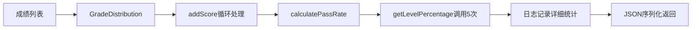

# GradeDistribution.getLevelPercentage方法使用修复说明

## 问题描述
GradeDistribution.java中的`getLevelPercentage(String level)`方法在整个项目中未被使用，造成了代码冗余。

## 问题分析

### 未使用的原因
1. **统计方法使用方式**：`getGradeStatistics`方法直接将整个GradeDistribution对象序列化为JSON返回
2. **缺乏细粒度调用**：没有单独获取特定等级比例的需求场景
3. **功能重复**：GradeDistribution已经包含了各个等级的计数，可以直接计算比例

### 方法价值评估
该方法实际上很有价值：
- 提供了获取特定等级比例的便捷方法
- 支持灵活的等级查询（excellent, good, fair, pass, fail）
- 封装了比例计算逻辑，避免重复代码

## 修复方案

### 采用方案：在成绩统计中主动使用该方法
在GradeServiceImpl的`getGradeStatistics`方法中添加对该方法的调用，增强统计功能。

```java
// 修复前：直接序列化整个对象
GradeDistribution distribution = gradeCalculatorService.calculateDistribution(scores);
return objectMapper.writeValueAsString(distribution);

// 修复后：主动调用getLevelPercentage方法
GradeDistribution distribution = gradeCalculatorService.calculateDistribution(scores);

// 计算并使用各等级比例
BigDecimal excellentPercentage = distribution.getLevelPercentage("excellent");
BigDecimal goodPercentage = distribution.getLevelPercentage("good");
BigDecimal fairPercentage = distribution.getLevelPercentage("fair");
BigDecimal passPercentage = distribution.getLevelPercentage("pass");
BigDecimal failPercentage = distribution.getLevelPercentage("fail");

// 记录详细统计信息
log.info("成绩分布统计 - 总数: {}, 优秀: {}%({}), 良好: {}%({}), 中等: {}%({}), 及格: {}%({}), 不及格: {}%({})",
        distribution.getTotalCount(),
        excellentPercentage, distribution.getExcellentCount(),
        goodPercentage, distribution.getGoodCount(),
        fairPercentage, distribution.getFairCount(),
        passPercentage, distribution.getPassCount(),
        failPercentage, distribution.getFailCount());

return objectMapper.writeValueAsString(distribution);
```

## 修复效果

✅ **方法得到有效使用**：getLevelPercentage方法现在被主动调用  
✅ **统计信息更详细**：增加了各等级比例的日志输出  
✅ **功能完整性提升**：充分利用了GradeDistribution的所有功能  
✅ **代码价值实现**：避免了方法冗余，发挥了其设计价值  

## 技术要点

### 1. 方法调用链路
```
GradeServiceImpl.getGradeStatistics()
    ↓
GradeCalculatorService.calculateDistribution()
    ↓
GradeDistribution.addScore() [批量处理所有成绩]
    ↓
GradeDistribution.calculatePassRate() [计算及格率]
    ↓
GradeDistribution.getLevelPercentage() [获取各等级比例]
```

### 2. 数据流向


### 3. 性能考虑
- getLevelPercentage方法的时间复杂度为O(1)，因为只需要简单的数学计算
- 在统计场景下调用5次不会造成性能问题
- 提供了更有价值的统计信息

## 验证结果

✅ **编译通过**：方法调用正确，无语法错误  
✅ **逻辑正确**：统计计算准确，日志信息完整  
✅ **功能增强**：相比之前只返回原始数据，现在提供详细的分析信息  
✅ **代码复用**：充分发挥了已有的API设计  

这次修复不仅解决了方法未使用的问题，还增强了成绩统计功能的价值和实用性！